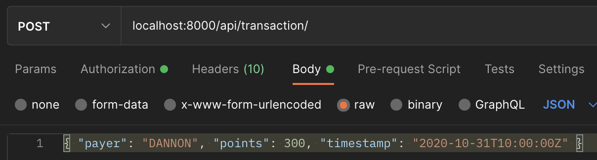
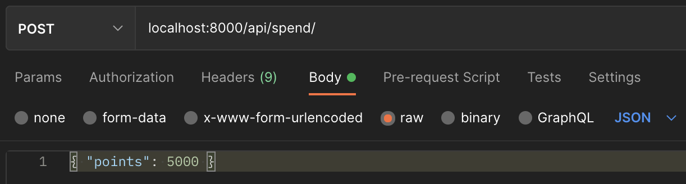

# Fetch Rewards - Coding Exercise

Chosen langauge: Python 3 - [Download Python here](https://www.python.org/downloads/)

Dependencies:

- PostgreSQL

  > [Download PostgreSQL here](https://www.postgresql.org/download/) > [How to start PostgreSQL server](https://www.postgresql.org/docs/9.1/server-start.html)

- Django (preferred framework)
- Psycopg2 (PostgreSQL database adapter for Python)
- Postman (used for HTTP requests)
  > [Download Postman here](https://www.postman.com/downloads/)

### Steps:

1. Clone or Download the Zip file for this repository
1. Once inside of the folder run the command from you terminal/command line to create a Python virtual enviroment.
   > Steps to accomplish this step can be found [here](https://docs.python.org/3/library/venv.html)
   > For Mac computers this command is `pipenv shell`
1. Once inside the virtual environment run `pipenv install` in order to install project dependencies (Django and Psycopg2)
1. After installation create the PostgreSQL database by running `psql postgres -f settings.sql` from the folder where `settings.sql` is located.
   > This command will create the database used in the exercise and a user to access the database - the config for access is done in the file `fetch_rewards/settings.py` in the `DATABASES` configuration
1. Once database and user are created run the command `migrate` command so all the changes done can be applied to the database
   > On Mac computers this command is excuted by calling: `python3 manage.py migrate` or `./manage.py migrate`
1. Once migrations are done, run `./manage.py runserver` or `python3 manage.py runserver` to start program
1. To add transactions to the database you can make a POST request to the route: `localhost:8000/api/transaction/` with an object containing `payer (string), points (integer), timestamp (date)` key-value pairs, like so:
   ```json
   {
     "payer": "DANNON",
     "points": 300,
     "timestamp": "2020-11-02T14:00:00Z"
   }
   ```
   
   > Make sure to add the Header: `Content-Type: application/json` to the request
1. To use the business logic detailed on the exercise make a call to `localhost:8000/api/spend/` with an object containing `points (integer)` key-value pair, like so:
   ```json
   { "points": 5000 }
   ```
   
1. To get the balances make a GET call to `localhost:8000/api/balances/`, like so:
   
